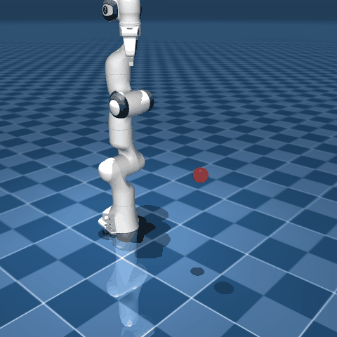
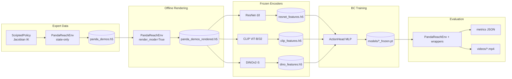

# Visuomotor Imitation Learning for Panda Reach with Frozen Vision Encoders

[](https://www.python.org/)
[](https://pytorch.org/)
[](https://mujoco.org/)
[](https://gymnasium.farama.org/)
[](LICENSE)

Simulation study comparing **ResNet-18**, **CLIP (ViT-B/32)**, and **DINOv2-S** as **frozen** vision encoders for behavior cloning on a Franka Panda visual reaching task. A Jacobian IK expert provides demonstrations; learned policies map **64×64 RGB** to **8-D** joint commands through a shared MLP action head.


**Links:** [Results](#results) · [Quick start](#quick-start) · [Install](#installation) · [Reproduce](#reproducing-experiments) · [Report (PDF)](report.pdf)

---

## At a glance

| | |
|--|--|
| **Question** | Which off-the-shelf vision backbone works best for **image-only** imitation on a tabletop reach task? |
| **Setup** | 100 IK expert demos → offline render → frozen features → BC (200 epochs) → closed-loop MuJoCo eval |
| **Best closed-loop (5 ep, seed 42)** | **CLIP 100%** success · ResNet **80%** · DINOv2-S **60%** (384-D, lightweight) |
| **Expert baseline** | **100%** success in ~45 steps (imitation gap remains) |
| **Extras** | Perturbation benchmark (lighting, occlusion, noise) · Colab notebooks · exported metrics JSON |

<p align="center">
  
</p>

<p align="center"><sub>MuJoCo reach task: end-effector to goal marker (success within 5 cm). Brief hold at goal.</sub></p>

**Headline finding:** Frozen foundation features are enough for non-trivial reaching; **encoder choice and embedding size matter less than you might expect** for BC loss—DINOv2-S at **384-D** tracks ResNet/CLIP closely in feature space and in rollouts.

---

## Quick start

1. **Results** — [Closed-loop metrics](#closed-loop-evaluation), [training losses](#training-validation-smooth-l1-on-held-out-transitions), and rollout MP4s in [`videos/`](videos/).
2. **Reproduce** — `notebooks/training.ipynb` → `notebooks/eval.ipynb` on Colab (Drive mount: `visual-policy-learning`).
3. **Details** — [Methodology](#methodology) and [robustness](#robustness-evaluation).

---

## Background

Visuomotor policies often need large datasets or full fine-tuning. Here we test whether **fixed, pretrained** encoders (ResNet, CLIP, DINOv2) are enough for a simple reach skill when the policy only sees **RGB**.

Pipeline: state-only expert rollouts → offline render → frozen features → shared MLP action head. Same loss and schedule across encoders so comparisons stay fair. Perturbation wrappers stress-test observations before any real-hardware work.

---

## Tech stack

| Area | Components |
|------|------------|
| **Simulation** | MuJoCo, Gymnasium, Franka Panda MJCF, Jacobian IK expert |
| **Learning** | Behavior cloning, HDF5 demos, Smooth L1, train/val split, closed-loop eval |
| **Vision** | Frozen ResNet-18, CLIP ViT-B/32, DINOv2-S; PyTorch action head |
| **Tooling** | Colab notebooks, `results/metrics/*.json`, perturbation wrappers |

---

## Table of Contents

- [At a glance](#at-a-glance)
- [Quick start](#quick-start)
- [Background](#background)
- [Tech stack](#tech-stack)
- [Overview](#overview)
- [Key Contributions](#key-contributions)
- [Methodology](#methodology)
- [Project Structure](#project-structure)
- [Pipeline Diagram](#pipeline-diagram)
- [Installation](#installation)
- [Reproducing Experiments](#reproducing-experiments)
- [Results](#results)
- [Robustness Evaluation](#robustness-evaluation)
- [Notebooks](#notebooks)
- [Artifacts checklist](#artifacts-checklist)
- [Limitations & Future Work](#limitations--future-work)
- [License](#license)

---

## Overview

| Item | Description |
|------|-------------|
| **Task** | Visual reaching: move the Panda end-effector within 5 cm of a randomly sampled 3D goal |
| **Simulator** | [MuJoCo](https://mujoco.org/) 3.x + [Gymnasium](https://gymnasium.farama.org/) |
| **Expert** | Damped least-squares Jacobian IK (`ScriptedPolicy`) |
| **Learner** | Behavior cloning: frozen encoder → MLP → 8-D actuator commands |
| **Encoders** | ResNet-18 (ImageNet), CLIP ViT-B/32 (OpenAI), DINOv2-S (`vit_small_patch14_dinov2`) |
| **Observation** | 64×64 RGB (rendered offline from saved joint states) |
| **Action** | 7 arm joint targets + 1 gripper channel |

The repo is set up for **reproducibility**: scripts and notebooks for the full pipeline, with metrics exported under `results/metrics/`.

---

## Key Contributions

1. **Unified BC pipeline** — Same action head, loss, and training schedule across three foundation-model encoders for fair comparison.
2. **Efficient data collection** — State-only rollouts during demo collection; RGB replayed deterministically from saved `qpos` and goal positions.
3. **Frozen-feature training** — Decouples heavy backbone inference from BC optimization (`train_bc_frozen.py`), enabling large batch sizes on modest GPUs.
4. **Robustness suite** — Image perturbations (lighting, occlusion, noise) via composable Gym wrappers for sim-to-real stress testing.

---

## Methodology

### 1. Simulation Environment

`PandaReachEnv` wraps a MuJoCo Panda scene with a mocap goal marker. Each episode:

- Samples a target in workspace bounds: \(x \in [0.45, 0.60]\), \(y \in [-0.15, 0.15]\), \(z \in [0.30, 0.50]\)
- Uses **image-only** observations (`obs["image"]`, uint8 HWC)
- Defines success when \(\|p_{\mathrm{ee}} - p_{\mathrm{target}}\|_2 < 0.05\) m
- Reward: \(-\|p_{\mathrm{ee}} - p_{\mathrm{target}}\|_2 - 0.01\|q_{\mathrm{vel}}\|_2\), with **+10** bonus on success

```python
# envs/panda_reach_env.py — core success criterion
self.success_threshold = 0.05
reward = -dist - 0.01 * np.linalg.norm(self.data.qvel[:self.arm_dofs])
if info["success"]:
    reward += 10.0
```

### 2. Expert Demonstrations

The expert (`policies/scripted_policy.py`) uses **damped least-squares IK**:

\[
\Delta q = J^\top (J J^\top + \lambda^2 I)^{-1} (k_p \cdot e), \quad e = \mathrm{clip}(p_{\mathrm{target}} - p_{\mathrm{ee}})
\]

On a 20-episode sanity check (`notebooks/expert.ipynb`), the scripted policy achieves **100% success** (mean success step ≈ 45).

**Dataset collection** (`data/collect_demos.py`, `notebooks/data.ipynb`):

| Setting | Value |
|---------|-------|
| Episodes | 100 |
| `max_steps` | 300 |
| `render_mode` | `False` (zero image placeholders; states stored) |
| Seed | 42 |
| Output | `data/panda_demos.h5` |

Stored fields: `observations`, `states`, `actions`, `targets`, `rewards`, `dones`, `success`, `episode_ends`.

### 3. Offline Rendering & Subsampling

`notebooks/training.ipynb` replays joint trajectories with `render_mode=True`, restoring goal positions via `set_target()`. Frames are subsampled with **`stride = 3`** to reduce redundancy → `data/panda_demos_rendered.h5`.

### 4. Frozen Feature Extraction

Each encoder maps 64×64 RGB → 224×224 (bilinear) → normalized features:

| Encoder | Backbone | Feature dim | Normalization |
|---------|----------|-------------|---------------|
| ResNet | `resnet18` (ImageNet weights) | 512 | ImageNet mean/std |
| CLIP | `ViT-B-32` (OpenAI) | 512 | CLIP mean/std + L2 normalize |
| DINOv2 | `vit_small_patch14_dinov2.lvd142m` | 384 | ImageNet mean/std + L2 normalize |

Outputs: `data/panda_{resnet,clip,dino}_features.h5` (`features`, `actions`).

### 5. Behavior Cloning (Action Head Only)

`training/train_bc_frozen.py` trains an MLP `ActionHead` on frozen features:

- **Loss:** Smooth L1 (`beta=0.02`)
- **Optimizer:** AdamW (`lr=1e-4`, `weight_decay=1e-4`)
- **Scheduler:** Cosine annealing over 200 epochs
- **Split:** 80% train / 20% val (sequential)
- **Batch size:** 256 (features) / 64 (extraction)
- **Checkpoints:** `models/{resnet,dino,clip}_frozen.pt` + per-epoch logs in `models/checkpoints/*/logs.csv`

Architecture (`policies/action_head.py`):

```
LayerNorm → Linear(512/384 → 512) → ReLU → Dropout
         → Linear(512 → 512) → ReLU → Dropout
         → Linear(512 → 256) → ReLU
         → Linear(256 → 8)   # actuator-space, no tanh
```

### 6. Deployment Policy

At inference (`evals/eval_utils.py`), the full policy runs end-to-end:

```
RGB (64×64) → frozen encoder → ActionHead → clip to actuator limits → env.step()
```

Optional mixed-precision (`torch.amp.autocast`) and action repeat for faster rollouts.

### 7. Evaluation Protocol

| Metric | Definition |
|--------|------------|
| **Success rate** | Fraction of episodes with terminal success |
| **Avg reward** | Sum of per-step rewards |
| **Avg steps** | Steps until success or horizon |
| **Reward std** | Standard deviation across episodes |

Standard eval: 5 episodes, `max_steps=300`, `physics_steps=4`, rendered 64×64 images.

---

## Project Structure

```
visual-policy-learning/
├── envs/
│   ├── panda_reach_env.py      # Gymnasium MuJoCo reach task
│   └── panda/                  # MJCF assets (Panda + scene + meshes)
├── policies/
│   ├── scripted_policy.py      # Jacobian IK expert
│   ├── base_policy.py          # encoder + action head wrapper
│   ├── action_head.py          # BC MLP
│   ├── load_policy.py          # checkpoint loading
│   ├── clip_policy.py          # CLIP encoder + head (e2e path)
│   └── encoders/               # ResNet, CLIP, DINOv2 encoders (frozen)
├── data/
│   └── collect_demos.py        # HDF5 demo collection utilities
├── training/
│   ├── train_bc_frozen.py      # train on precomputed features (main)
│   ├── train_bc_e2e.py         # optional end-to-end BC
│   └── render_dataset.py       # legacy render helper
├── evals/
│   ├── eval_utils.py           # rollouts, metrics, video export
│   ├── robustness_tests.py     # perturbation benchmark
│   └── wrappers.py             # lighting / occlusion / noise
├── models/
│   └── checkpoints/            # training logs (CSV per run)
├── results/
│   └── metrics/                # eval_results.json, robustness_results.json
├── notebooks/                  # Colab-oriented pipeline
│   ├── data.ipynb              # expert data collection
│   ├── training.ipynb          # render → features → BC train
│   ├── eval.ipynb              # metrics, robustness, videos
│   ├── expert.ipynb            # IK expert validation
│   └── env.ipynb               # environment smoke tests
├── demo.gif                    # README preview (sim reach)
├── pyproject.toml
├── report.pdf                  # project summary (PDF)
└── videos/                     # BC rollout recordings (clip, resnet, dino)
```

---

## Pipeline Diagram



---

## Installation

### Requirements

- Python ≥ 3.10
- CUDA-capable GPU recommended (feature extraction & eval)
- Linux with **EGL** for headless MuJoCo rendering (`MUJOCO_GL=egl`)

### Clone & Environment

```bash
git clone https://github.com/noelkelias/visual-policy-learning.git
cd visual-policy-learning
export MUJOCO_GL=egl   # headless rendering

pip install -e .
```

> **Colab:** Set `os.environ["MUJOCO_GL"] = "egl"` before importing MuJoCo (see notebooks).

Large artifacts (datasets, checkpoints) live under `data/` and `models/` — generate via notebooks below. Rollout videos are in `videos/`.

---

## Reproducing Experiments

### Quick path (notebooks)

| Step | Notebook | Output |
|------|----------|--------|
| 1. Collect demos | `notebooks/data.ipynb` | `data/panda_demos.h5` |
| 2. Render + features + train | `notebooks/training.ipynb` | `data/panda_*_features.h5`, `models/*_frozen.pt` |
| 3. Evaluate + videos | `notebooks/eval.ipynb` | `results/metrics/*.json`, `videos/*.mp4` |

### Command-line training (after feature HDF5 files exist)

```bash
python training/train_bc_frozen.py \
  --data data/panda_resnet_features.h5 \
  --model_name resnet_frozen \
  --action_dim 8 --epochs 200 --batch_size 64 --lr 1e-4

python training/train_bc_frozen.py \
  --data data/panda_clip_features.h5 \
  --model_name clip_frozen \
  --action_dim 8 --epochs 200 --batch_size 64 --lr 1e-4

python training/train_bc_frozen.py \
  --data data/panda_dino_features.h5 \
  --model_name dino_frozen \
  --action_dim 8 --epochs 200 --batch_size 64 --lr 1e-4
```

DINO features are **L2-normalized** (same idea as CLIP). After changing the encoder, re-run DINO extraction in `notebooks/training.ipynb` before retraining.

### Expert sanity check

```bash
# Or run notebooks/expert.ipynb
jupyter notebook notebooks/expert.ipynb
```

---

## Results

Results below come from the Colab pipeline in `notebooks/` (see `results/metrics/` for exported JSON). Dataset: **100** expert episodes → **1,541** subsampled transitions after offline render (`stride=3`).

### Expert & data collection (`notebooks/expert.ipynb`, `notebooks/data.ipynb`)

| Metric | Scripted IK expert |
|--------|-------------------|
| Success rate (n=20) | **100%** |
| Mean success step | **44.7** |
| Mean final distance | 4.1 cm |

Full demo collection (`notebooks/data.ipynb`, seed 42): **100/100** episodes successful; **4,623** state-only steps stored in `data/panda_demos.h5`.

### Training (validation Smooth L1 on held-out transitions)

200 epochs, AdamW + cosine schedule (`notebooks/training.ipynb`, `models/checkpoints/*/logs.csv`):

| Model | Feature dim | Best val loss | Final train / val (epoch 199) |
|-------|-------------|---------------|-------------------------------|
| **ResNet-18** | 512 | **0.0177** | 0.0113 / 0.0180 |
| **DINOv2-S** | **384** | 0.0200 | 0.0153 / 0.0207 |
| **CLIP ViT-B/32** | 512 | 0.0234 | 0.0184 / 0.0239 |

Lower validation loss means better open-loop action matching on the demo distribution; it does not guarantee closed-loop success.

**DINOv2 note:** We use **DINOv2-S** (`vit_small_patch14_dinov2`) with **384-dimensional** embeddings—smaller than the **512-D** ResNet and CLIP features—on purpose for a **lightweight** backbone in this comparison. Feature-space BC loss is only slightly above ResNet (0.020 vs 0.018) and better than CLIP, so the reduced dimension does not prevent the action head from fitting demonstrations. At deployment, DINO still reaches **60%** closed-loop success (vs **80%** ResNet, **100%** CLIP on the run below), i.e. nearly as strong as the larger encoders despite fewer features per frame.

### Closed-loop evaluation

5 episodes per policy, rendered 64×64 observations, `max_steps=300`:

| Policy | Success rate ↑ | Avg reward ↑ | Avg steps | Reward std |
|--------|----------------|--------------|-----------|------------|
| **CLIP** | **100%** | **-10.59** | **43.0** | 2.87 |
| **ResNet-18** | 80% | -14.72 | 56.2 | 9.52 |
| **DINOv2-S** | 60% | -20.12 | 69.8 | 11.03 |

**Takeaways:** All three policies learn useful reaching behavior from frozen features; CLIP leads this seed on success rate, ResNet is a close second, and DINO trails slightly in success but stays in the same ballpark. Metrics are noisy at 5 episodes—re-run `notebooks/eval.ipynb` with more episodes for stabler estimates.

**Rollouts:** [`videos/`](videos/) (regenerate from `eval.ipynb` if needed).

### Expert vs imitation gap

The scripted expert solves **100%** of evaluation episodes in ~45 steps, while learned policies succeed on a fraction of rollouts. That gap is expected with ~100 demos, image-only inputs, and no closed-loop correction (DAgger, etc.).

---

## Robustness Evaluation

`evals/robustness_tests.py` applies observation wrappers **at runtime** (`notebooks/eval.ipynb`):

| Condition | Perturbation |
|-----------|----------------|
| `normal` | Unmodified |
| `dark` | Brightness × 0.5 |
| `bright` | Brightness × 1.5 |
| `occlusion` | 16×16 black patch (image center region) |
| `noise` | Gaussian noise (σ = 15) |

Results are saved to `results/metrics/robustness_results.json`. The notebook run uses **1 episode per condition** (high variance); increase `num_episodes` for reporting:

```python
from evals.robustness_tests import run_robustness_suite
results = run_robustness_suite(env_fn=make_env, models=models, num_episodes=20)
```

**Success rate** (1 episode per cell — illustrative only):

| Condition | ResNet | DINOv2-S | CLIP |
|-----------|--------|----------|------|
| normal | 100% | 100% | 0% |
| dark | 0% | 0% | 0% |
| bright | 100% | 0% | 0% |
| occlusion | 0% | **100%** | **100%** |
| noise | 0% | 0% | 0% |

**Avg reward** (higher is better; same 1-episode run):

| Condition | ResNet | DINOv2-S | CLIP |
|-----------|--------|----------|------|
| normal | -16.45 | **-9.24** | -31.74 |
| dark | -32.93 | -30.88 | **-29.22** |
| bright | **-5.59** | -38.27 | -32.28 |
| occlusion | -33.07 | **-6.07** | -8.77 |
| noise | -34.29 | -42.73 | -33.48 |

No single encoder wins every perturbation; DINOv2-S is strongest on **occlusion** and **normal** reward in this snapshot, while ResNet handles **bright** well. Treat these as qualitative stress tests until evaluated with more episodes.

---

## Notebooks

| Notebook | Purpose |
|----------|---------|
| `data.ipynb` | Collect 100 expert episodes → HDF5 |
| `training.ipynb` | Render frames, extract features, train all three BC heads |
| `eval.ipynb` | Load checkpoints, standard + robustness eval, save videos |
| `expert.ipynb` | Validate scripted IK expert |
| `env.ipynb` | Environment and rendering smoke tests |
| `testing.ipynb` | Policy module inspection (dev) |

Designed for **Google Colab** with Google Drive mount (`/content/drive/MyDrive/visual-policy-learning`).

**Suggested run order for a new machine:** `env.ipynb` → `expert.ipynb` → `data.ipynb` → `training.ipynb` → `eval.ipynb`.

### Programmatic video export

```python
import torch
from envs.panda_reach_env import PandaReachEnv
from evals.eval_utils import rollout_episode
from policies.encoders.dinov2_encoder import DINOv2Encoder
from policies.load_policy import load_policy

device = "cuda" if torch.cuda.is_available() else "cpu"
model = load_policy(
    DINOv2Encoder(),
    encoder_dim=384,
    action_dim=8,
    path="models/dino_frozen.pt",
    device=device,
).to(device)

env = PandaReachEnv(render_mode=True, image_width=64, image_height=64, physics_steps=4)
rollout_episode(
    env, model,
    max_steps=300,
    save_video=True,
    video_path="videos/dino_demo.mp4",
    render_every=2,
)
env.close()
```

---

## Artifacts checklist

| Artifact | In repo? | How to obtain |
|----------|----------|---------------|
| `data/panda_demos.h5` | Usually no (large) | `notebooks/data.ipynb` |
| `data/panda_*_features.h5` | Usually no | `notebooks/training.ipynb` |
| `models/*_frozen.pt` | Optional | `notebooks/training.ipynb` or `train_bc_frozen.py` |
| `results/metrics/*.json` | **Yes** | Committed snapshot; refresh via `eval.ipynb` |
| `models/checkpoints/*/logs.csv` | **Yes** | Training logs |
| `videos/*.mp4` | **Yes** | Included in repo; regenerate via `eval.ipynb` |

**Reproducibility:** expert/data collection `seed=42`; BC uses sequential 80/20 split; eval uses 5 episodes (`num_episodes=5` in `eval.ipynb`). Report GPU type and library versions when comparing numbers.

**Rough runtime (Colab T4-class GPU):** data collection ~10–15 min · render + features + train ~30–60 min · eval + videos ~10 min.

---

## Limitations & Future Work

- **Small demonstration set** (~100 episodes, **1,541** transitions after stride-3) limits generalization and makes metrics sensitive to seed and episode count.
- **Train/eval distribution gap:** BC trains on offline-rendered frames; closed-loop rollouts accumulate drift not seen in the dataset.
- **Image-only BC:** No proprioception or explicit goal geometry—only pixels carry target information.
- **Frozen encoders:** No adaptation of visual representations to the Panda camera and workspace.
- **Encoder size mismatch:** DINOv2-S (384-D) is deliberately smaller than ResNet/CLIP (512-D); fairer comparisons could fix embedding size (projection head or DINOv2-B) or parameter/FLOP budgets.

### Suggested next steps

1. **Scale data & evaluation** — More expert demos, domain randomization (lighting, textures, camera pose), and ≥20–50 eval episodes per policy for stable success rates.
2. **Close the imitation gap** — DAgger or filtered BC on closed-loop failures; action chunking or delta actions instead of raw actuator targets.
3. **Richer observations** — Fuse RGB with joint positions / EE pose (`states` already in HDF5) via a small proprioception MLP before the action head.
4. **End-to-end & partial finetuning** — Unfreeze last blocks of the vision backbone (`train_bc_e2e.py`) or train a light adapter (LoRA) on rendered images.
5. **Stronger & matched vision backbones** — Compare DINOv2-B (768-D), SigLIP, or R3M with matched feature dimension via a shared projection layer.
6. **Augmentation at train time** — Mirror the robustness wrappers (noise, occlusion, brightness) during feature extraction or BC so policies are not evaluated on corruptions they never saw.
7. **Sim-to-real protocol** — Use `evals/wrappers.py` as a benchmark suite, then collect a small real-world demo set and fine-tune only the action head (or adapter) on real features.
8. **Hyperparameter sweep** — Learning rate, Smooth L1 `beta`, action repeat, and horizon; log to Weights & Biases for reproducibility across seeds.

---

## License

MIT — see [LICENSE](LICENSE).
