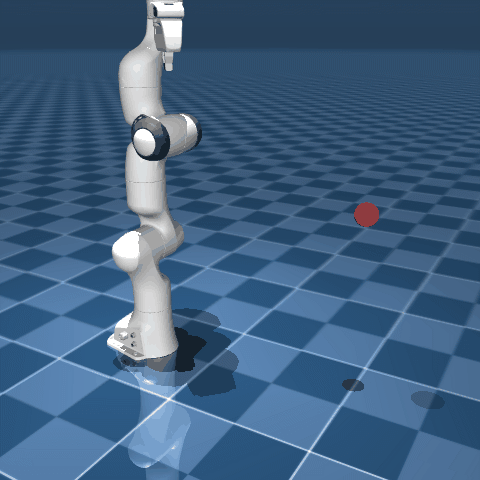
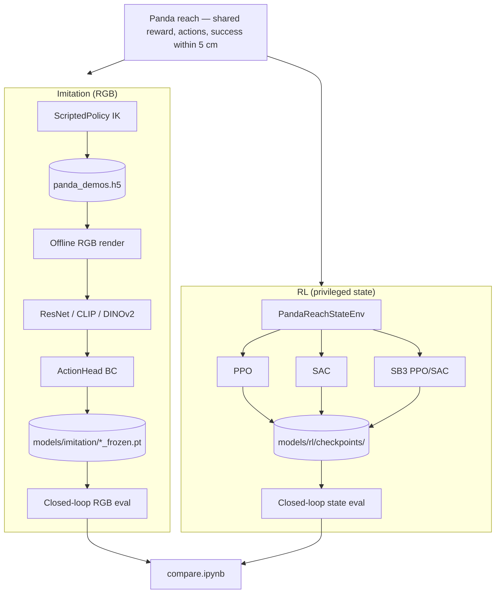
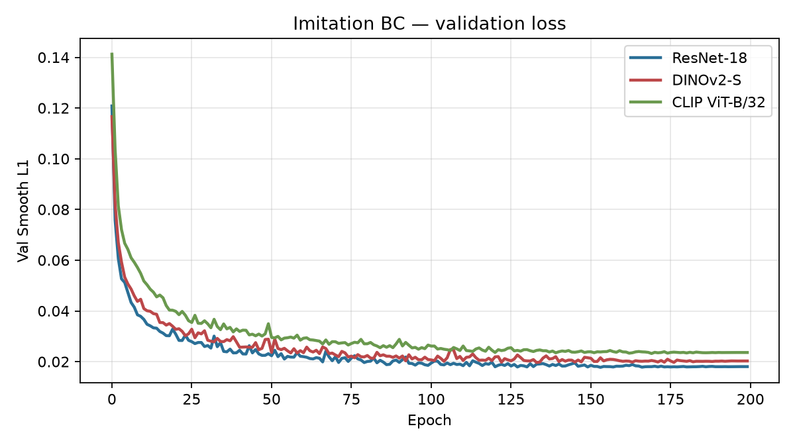
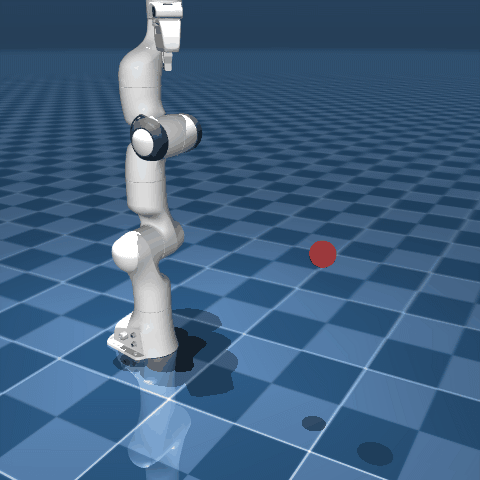
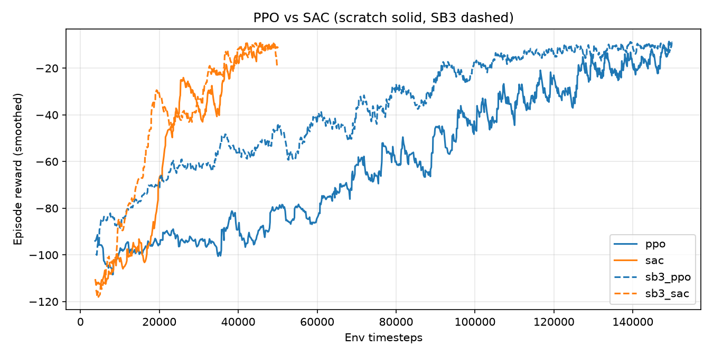
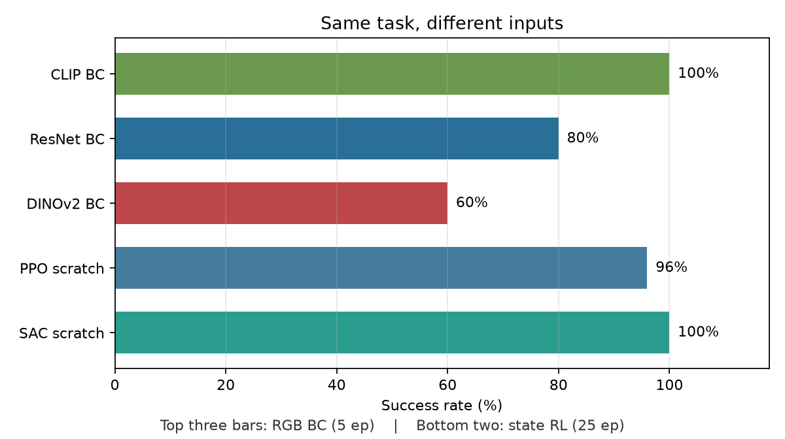
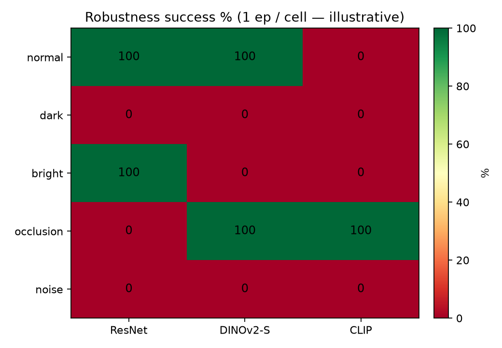

# Visual Policy Learning for Panda Reach using Imitation and Reinforcement Learning

[](https://www.python.org/)
[](https://pytorch.org/)
[](https://mujoco.org/)
[](https://gymnasium.farama.org/)
[](https://stable-baselines3.readthedocs.io/)
[](https://huggingface.co/models)
[](LICENSE)

MuJoCo Panda reach with **visual imitation** (frozen ResNet-18 / CLIP / DINOv2-S BC) and **online RL** (PPO, SAC) on the same dense reward and actions. Shared env and success rule (EE within 5 cm)—different learning signals and observation modalities.

**Links:** [Results](#results) · [Quick start](#quick-start) · [Install](#installation) · [Reproduce](#reproducing-experiments) · [Report (PDF)](report.pdf)

---

## At a glance

| | |
|--|--|
| **Question** | How well can we learn Panda reaching via **imitation (RGB)** and **RL (state)**, and what do encoder / algo choices change? |
| **Task** | Reach a random 3D target; success if EE–goal distance < 5 cm |
| **Imitation** | 100 IK demos → frozen features → BC → closed-loop RGB eval |
| **Best BC (5 ep)** | **CLIP 100%** · ResNet **80%** · DINOv2-S **60%** |
| **RL (25 ep)** | **SAC 100%** @ 50k · **PPO 96%** @ 150k (privileged state; SB3 matches) |
| **Expert** | **100%** success in ~45 steps |

<p align="center">
  
</p>

<p align="center"><sub>EE to goal within 5 cm.</sub></p>

---

## Quick start

1. **Results** — [Results](#results), GIFs/MP4s in [`videos/`](videos/), figures under `results/metrics/figures/`.
2. **Reproduce** — `notebooks/imitation/` → `notebooks/rl/` → `notebooks/compare.ipynb`.
3. **Details** — [Methodology](#methodology), [report PDF](report.pdf).

---

## Background

Learning robot reaching from pixels is hard because failures mix **vision** and **control**. This project studies both on one MuJoCo Panda reach task:

1. **Imitation** — behavior cloning from an IK expert with frozen ResNet / CLIP / DINOv2 features (image-only).
2. **RL** — PPO and SAC on privileged state with the same reward and actions, to show what the control problem looks like without vision.

Same scene, success threshold, and action interface throughout. RGB vs state is intentional: it separates “can we see the goal?” from “can we move there?”

---

## Tech stack

| Area | Components |
|------|------------|
| **Simulation** | MuJoCo, Gymnasium, Franka Panda MJCF, Jacobian IK expert |
| **Imitation** | Behavior cloning, HDF5 demos, Smooth L1, frozen ResNet / CLIP / DINOv2 |
| **RL** | PPO / SAC on privileged state (`PandaReachStateEnv`); SB3 PPO / SAC under the same budgets |
| **Tooling** | Colab notebooks, `results/metrics/*.json`, perturbation wrappers |

---

## Table of Contents

- [At a glance](#at-a-glance)
- [Quick start](#quick-start)
- [Background](#background)
- [Tech stack](#tech-stack)
- [Overview](#overview)
- [Key Contributions](#key-contributions)
- [Methodology](#methodology)
- [Project Structure](#project-structure)
- [Pipeline Diagram](#pipeline-diagram)
- [Installation](#installation)
- [Reproducing Experiments](#reproducing-experiments)
- [Results](#results)
- [Robustness Evaluation](#robustness-evaluation)
- [Notebooks](#notebooks)
- [Limitations & Future Work](#limitations--future-work)
- [License](#license)

---

## Overview

| Item | Description |
|------|-------------|
| **Task** | Reach: move the Panda end-effector within 5 cm of a randomly sampled 3D goal |
| **Simulator** | [MuJoCo](https://mujoco.org/) 3.x + [Gymnasium](https://gymnasium.farama.org/) |
| **Expert** | Damped least-squares Jacobian IK (`ScriptedPolicy`) |
| **Imitation** | Frozen encoder → MLP → 8-D actuator commands (64×64 RGB) |
| **Encoders** | ResNet-18, CLIP ViT-B/32, DINOv2-S |
| **RL** | PPO / SAC on flat privileged state (qpos, qvel, target, optional ee−target) |
| **Action** | 7 arm joint targets + 1 gripper channel (shared) |

Scripts and notebooks cover the full pipeline; metrics live under `results/metrics/`.

---

## Key Contributions

1. **One reach task, two learning regimes** — Imitation (RGB BC) and RL (state PPO/SAC) share reward, actions, and success criterion.
2. **Fair frozen-encoder BC** — Same action head, loss, and schedule across ResNet, CLIP, and DINOv2.
3. **Efficient demo pipeline** — State-only collection; RGB replayed offline from saved `qpos` and goals.
4. **On- vs off-policy RL** — PPO vs SAC (ours + SB3); algo-appropriate step budgets.
5. **Robustness wrappers** — Lighting, occlusion, and noise stress tests for RGB policies.

---

## Methodology

One MuJoCo Panda **reach** task (EE within 5 cm of a random 3D goal). Two ways to learn the same skill: **imitation** from vision and **RL** from privileged state. Shared reward, 8-D actions, and success criterion throughout.

### Shared task

`PandaReachEnv` / `PandaReachStateEnv` use the same scene and goal sampling:

- Workspace: x ∈ [0.45, 0.60], y ∈ [−0.15, 0.15], z ∈ [0.30, 0.50]
- Success: ‖p_ee − p_target‖₂ < 0.05 m
- Dense reward: −‖p_ee − p_target‖₂ − 0.01‖q_vel‖₂, with **+10** on success
- Action: 7 arm joint targets + 1 gripper channel

```python
# envs/panda_reach_env.py — core success criterion
self.success_threshold = 0.05
reward = -dist - 0.01 * np.linalg.norm(self.data.qvel[:self.arm_dofs])
if info["success"]:
    reward += 10.0
```

| Path | Env | Observation |
|------|-----|-------------|
| Imitation | `PandaReachEnv` | 64×64 RGB |
| RL | `PandaReachStateEnv` | `[qpos, qvel, target, optional ee−target]` |

### Imitation (frozen-encoder BC)

**Expert.** Damped least-squares Jacobian IK (`policies/scripted_policy.py`):

Δq = Jᵀ (J Jᵀ + λ² I)⁻¹ (k_p · e), e = clip(p_target − p_ee)

Sanity check: **100%** success, ~45 steps (`notebooks/imitation/expert.ipynb`). Collect **100** state-only demos → `data/panda_demos.h5` (seed 42).

**Offline RGB.** Replay trajectories with rendering, `stride=3` → **1,541** transitions (`data/panda_demos_rendered.h5`).

**Frozen encoders.** 64×64 → 224×224 → features:

| Encoder | Backbone | Dim |
|---------|----------|-----|
| ResNet | `resnet18` (ImageNet) | 512 |
| CLIP | `ViT-B-32` (OpenAI) | 512 |
| DINOv2 | `vit_small_patch14_dinov2` | 384 |

**Behavior cloning.** Train a shared MLP `ActionHead` on frozen features (`train_bc_frozen.py`): Smooth L1, AdamW + cosine, 200 epochs, 80/20 split. Checkpoints: `models/imitation/{resnet,dino,clip}_frozen.pt`.

```
LayerNorm → Linear → ReLU → Dropout → … → Linear(256 → 8)
```

**Deploy.** `RGB → frozen encoder → ActionHead → clip actuators → env.step()`.

### Reinforcement learning (PPO / SAC)

Train online on privileged state with the **same** dense reward and actions—so vision is not the bottleneck. Default runs are **PPO / SAC**; **SB3 PPO / SB3 SAC** are baselines. Call once per run from `notebooks/rl/training.ipynb` (or CLI below; `--backend scratch` = ours, `--backend sb3` = SB3).

| Algo | Role | Steps | Notes |
|------|------|-------|-------|
| **PPO** | On-policy | 150k | Obs/reward running norm (scratch: in `.pt`; SB3: `vecnormalize.pkl`) |
| **SAC** | Off-policy | 50k | More sample-efficient; no obs norm |

Actions are trained in `[-1, 1]` and unscaled to actuator limits on `env.step` (same convention as SB3). Scratch PPO/SAC need only the base package; SB3 needs `pip install -e ".[rl]"`.

```bash
pip install -e ".[rl]"   # Stable-Baselines3 (for --backend sb3)
# PPO / SAC
python training/train_rl.py --algo ppo --backend scratch --run_name ppo --seeds 42 --total_timesteps 150000
python training/train_rl.py --algo sac --backend scratch --run_name sac --seeds 42 --total_timesteps 50000
# SB3 PPO / SB3 SAC (same budgets)
python training/train_rl.py --algo ppo --backend sb3 --run_name sb3_ppo --total_timesteps 150000
python training/train_rl.py --algo sac --backend sb3 --run_name sb3_sac --total_timesteps 50000
```

Checkpoints: `models/rl/checkpoints/{ppo,sac}/seed_*/model.pt` (normalizer inside PPO `.pt`) and `sb3_{ppo,sac}/seed_*/model.zip` (+ `vecnormalize.pkl` for SB3 PPO).
### Evaluation

| Metric | Definition |
|--------|------------|
| Success rate | Fraction of episodes with terminal success |
| Avg reward / steps | Episode return and length |
| Reward std | Across episodes |

| Path | Episodes | Horizon | Notes |
|------|----------|---------|-------|
| Imitation | 5 | 300 | RGB + encoder (slow) |
| RL | 25 | 200 | State MLP (fast) |

Notebooks: `imitation/eval.ipynb` → `rl/env.ipynb` → `rl/training.ipynb` → `rl/eval.ipynb` → `compare.ipynb`.

---

## Project Structure

```
visual-policy-learning/
├── envs/
│   ├── panda_reach_env.py       # Gymnasium MuJoCo reach task (RGB)
│   ├── panda_reach_state_env.py # privileged state obs (+ sparse reward flag)
│   └── panda/                   # MJCF assets
├── policies/
│   ├── scripted_policy.py
│   ├── base_policy.py / action_head.py / load_policy.py
│   ├── ppo_policy.py / sac_policy.py           # PPO / SAC
│   ├── ppo_sb3_policy.py / sac_sb3_policy.py   # SB3 PPO / SAC
│   ├── clip_policy.py / *_policy.py
│   └── encoders/
├── data/
│   └── collect_demos.py
├── training/
│   ├── train_bc_frozen.py       # main imitation path
│   ├── train_bc_e2e.py          # optional end-to-end BC (RGB → actions)
│   ├── train_rl.py              # PPO/SAC (+ SB3 via --backend sb3)
│   ├── rl_utils.py              # action scale + obs/reward norm helpers
│   └── render_dataset.py        # legacy stub; RGB replay lives in training.ipynb
├── evals/
│   ├── eval_utils.py            # imitation + RL rollouts / metrics
│   ├── robustness_tests.py      # image perturbation helpers for RGB policies
│   └── wrappers.py
├── notebooks/
│   ├── imitation/               # behavior cloning / IL
│   │   ├── data.ipynb
│   │   ├── training.ipynb
│   │   ├── eval.ipynb
│   │   ├── expert.ipynb
│   │   └── env.ipynb
│   ├── rl/                      # reinforcement learning
│   │   ├── env.ipynb            # PandaReachStateEnv (480² preview render)
│   │   ├── training.ipynb       # train_rl.py ×4 (env built inside script)
│   │   └── eval.ipynb           # PPO / SAC vs SB3
│   └── compare.ipynb            # imitation vs RL (main comparison)
├── models/
│   ├── imitation/               # best {resnet,clip,dino}_frozen.pt + checkpoints/*/logs.csv
│   └── rl/checkpoints/          # {run}/seed_*/model.pt|.zip (+ SB3 PPO vecnormalize.pkl)
├── results/metrics/             # JSON + figures/
├── videos/                      # *.mp4 + *.gif rollouts
├── demo.gif / pyproject.toml / report.pdf
```

**Artifacts:** HDF5 demos under `data/` and bulky `epoch_*.pt` dumps are gitignored. Final IL weights (`models/imitation/*_frozen.pt`), RL finals (`model.pt` / `model.zip`), logs/curves, metrics, and videos are intended to be committed. Regen demos/weights via the notebooks if missing.

---

## Pipeline Diagram


```mermaid
flowchart TB
    TASK[Panda reach — shared reward, actions, success within 5 cm]

    subgraph IL["Imitation (RGB)"]
        direction LR
        IK[ScriptedPolicy IK] --> H5[(panda_demos.h5)]
        H5 --> RENDER[Offline RGB render]
        RENDER --> ENC[ResNet / CLIP / DINOv2]
        ENC --> BC[ActionHead BC]
        BC --> ILCKPT[(models/imitation/*_frozen.pt)]
        ILCKPT --> ILEVAL[Closed-loop RGB eval]
    end

    subgraph RL["RL (privileged state)"]
        direction LR
        SENV[PandaReachStateEnv] --> PPO[PPO]
        SENV --> SAC[SAC]
        SENV --> SB3[SB3 PPO/SAC]
        PPO --> RLCKPT[(models/rl/checkpoints/)]
        SAC --> RLCKPT
        SB3 --> RLCKPT
        RLCKPT --> RLEVAL[Closed-loop state eval]
    end

    TASK --> IL
    TASK --> RL
    ILEVAL --> CMP[compare.ipynb]
    RLEVAL --> CMP
```

---

## Installation

### Requirements

- Python ≥ 3.10
- CUDA-capable GPU recommended (feature extraction & eval)
- Linux with **EGL** for headless MuJoCo rendering (`MUJOCO_GL=egl`)

### Clone & Environment

```bash
git clone https://github.com/noelkelias/visual-policy-learning.git
cd visual-policy-learning
export MUJOCO_GL=egl   # headless rendering

pip install -e .
# RL extras (Stable-Baselines3 for --backend sb3)
pip install -e ".[rl]"
```

> **Colab:** Set `os.environ["MUJOCO_GL"] = "egl"` before importing MuJoCo (see notebooks). Local macOS usually uses the default GLFW backend (do not force `egl`).

Large artifacts (datasets, checkpoints) live under `data/` and `models/` — generate via notebooks below. Rollout videos are in `videos/`.

---

## Reproducing Experiments

### Quick path (notebooks)

| Step | Notebook | Output |
|------|----------|--------|
| 1. Collect demos | `notebooks/imitation/data.ipynb` | `data/panda_demos.h5` |
| 2. Render + features + train | `notebooks/imitation/training.ipynb` | `data/panda_*_features.h5`, `models/imitation/*_frozen.pt` |
| 3. Evaluate + videos | `notebooks/imitation/eval.ipynb` | `results/metrics/imitation/*.json`, `videos/*.mp4` |
| 4. State env check | `notebooks/rl/env.ipynb` | — |
| 5. Train RL | `notebooks/rl/training.ipynb` | `models/rl/checkpoints/{ppo,sac,sb3_*}/` |
| 6. Eval RL | `notebooks/rl/eval.ipynb` | `results/metrics/rl/*.json` |
| 7. Compare | `notebooks/compare.ipynb` | `results/metrics/imitation_vs_rl.json` |

Steps 4–6 mirror imitation: env notebook → `train_rl.py` cells (like `train_bc_frozen`) → eval.

### Command-line training (after feature HDF5 files exist)

```bash
python training/train_bc_frozen.py \
  --data data/panda_resnet_features.h5 \
  --model_name resnet_frozen \
  --action_dim 8 --epochs 200 --batch_size 64 --lr 1e-4

python training/train_bc_frozen.py \
  --data data/panda_clip_features.h5 \
  --model_name clip_frozen \
  --action_dim 8 --epochs 200 --batch_size 64 --lr 1e-4

python training/train_bc_frozen.py \
  --data data/panda_dino_features.h5 \
  --model_name dino_frozen \
  --action_dim 8 --epochs 200 --batch_size 64 --lr 1e-4
```

DINO features are **L2-normalized** (same idea as CLIP). After changing the encoder, re-run DINO extraction in `notebooks/imitation/training.ipynb` before retraining.

### Expert sanity check

```bash
# Or run notebooks/imitation/expert.ipynb
jupyter notebook notebooks/imitation/expert.ipynb
```

---

## Results

Results from the Colab / local pipeline in `notebooks/` (see `results/metrics/`). Dataset: **100** expert episodes → **1,541** subsampled transitions (`stride=3`). Same reach task throughout: imitation learns from RGB demos; RL learns online from privileged state.

### Expert & data collection (`notebooks/imitation/expert.ipynb`, `notebooks/imitation/data.ipynb`)

| Metric | Scripted IK expert |
|--------|-------------------|
| Success rate (n=20) | **100%** |
| Mean success step | **44.7** |
| Mean final distance | 4.1 cm |

Full demo collection (`notebooks/imitation/data.ipynb`, seed 42): **100/100** episodes successful; **4,623** state-only steps stored in `data/panda_demos.h5`.

### Training (validation Smooth L1 on held-out transitions)

200 epochs, AdamW + cosine schedule (`notebooks/imitation/training.ipynb`, `models/imitation/checkpoints/*/logs.csv`):

| Model | Feature dim | Best val loss | Final train / val (epoch 199) |
|-------|-------------|---------------|-------------------------------|
| **ResNet-18** | 512 | **0.0177** | 0.0113 / 0.0180 |
| **DINOv2-S** | **384** | 0.0200 | 0.0153 / 0.0207 |
| **CLIP ViT-B/32** | 512 | 0.0234 | 0.0184 / 0.0239 |

Lower validation loss means better open-loop action matching on the demo distribution; it does not guarantee closed-loop success.

**DINOv2 note:** We use **DINOv2-S** (`vit_small_patch14_dinov2`) with **384-dimensional** embeddings—smaller than the **512-D** ResNet and CLIP features—on purpose for a **lightweight** backbone. Feature-space BC loss is close to ResNet (0.020 vs 0.018) and better than CLIP, so the reduced dimension does not prevent fitting demos. Closed-loop success (**60%**) trails ResNet/CLIP here; that is expected at **64×64** with a patch-14 ViT (few tokens), not a claim that DINOv2 is weaker in general.

### Closed-loop: imitation (RGB)

5 episodes per policy, rendered 64×64 observations, `max_steps=300` (RGB + encoder is slow; n=5 keeps eval tractable):

| Policy | Success rate ↑ | Avg reward ↑ | Avg steps | Reward std |
|--------|----------------|--------------|-----------|------------|
| **CLIP** | **100%** | **-10.59** | **43.0** | 2.87 |
| **ResNet-18** | 80% | -14.72 | 56.2 | 9.52 |
| **DINOv2-S** | 60% | -20.12 | 69.8 | 11.03 |

CLIP leads this seed; ResNet second; DINO trails (also resolution-limited at 64×64). Metrics are noisy at 5 episodes.

<p align="center">
  
</p>

<p align="center">
  
</p>

<p align="center"><sub>CLIP BC closed-loop rollout (policy sees 64×64; GIF rendered at 480²).</sub></p>

**More rollouts:** [`videos/`](videos/).

### Expert vs imitation gap

The scripted expert solves **100%** of episodes in ~45 steps; BC policies succeed on a fraction. Expected with ~100 demos, image-only inputs, and no DAgger-style correction.

### Closed-loop: RL (privileged state)

Next we train online on the **same** dense reward and actions, but with low-dimensional state (`PandaReachStateEnv`) instead of RGB—so vision is not the bottleneck. PPO/SAC and SB3 share algo-appropriate budgets (SAC more sample-efficient; PPO uses obs/reward running norm). Eval: **25** episodes with resets seeded `42…66`.

| Method | Timesteps | Success rate ↑ | Avg reward | Avg steps |
|--------|-----------|----------------|------------|-----------|
| **SAC** | 50k | **100%** | -9.23 | 42.6 |
| **PPO** | 150k | **96%** | -13.07 | 50.0 |
| SB3 PPO | 150k | **100%** | -8.57 | 35.9 |
| SB3 SAC | 50k | **96%** | -11.58 | 42.7 |

Ours and SB3 reach similar success rates under these budgets.

<p align="center">
  
</p>

<p align="center"><sub>Episode reward vs env timesteps (smoothed). Solid = PPO/SAC; dashed = SB3.</sub></p>

### Putting it together

Same task, different inputs/learning rules (from `results/metrics/imitation_vs_rl.json`):

| Method | Learning | Obs | Success |
|--------|----------|-----|---------|
| CLIP BC | Imitation | RGB | 100% (5 ep) |
| ResNet BC | Imitation | RGB | 80% (5 ep) |
| DINOv2-S BC | Imitation | RGB | 60% (5 ep) |
| PPO | RL | state | 96% (25 ep, 150k) |
| SAC | RL | state | 100% (25 ep, 50k) |

<p align="center">
  
</p>

RGB success measures vision+control under BC; state RL measures control alone. Modalities differ on purpose.

---

## Robustness Evaluation

`evals/robustness_tests.py` applies observation wrappers **at runtime** (`notebooks/imitation/eval.ipynb`):

| Condition | Perturbation |
|-----------|----------------|
| `normal` | Unmodified |
| `dark` | Brightness × 0.5 |
| `bright` | Brightness × 1.5 |
| `occlusion` | 16×16 black patch (image center region) |
| `noise` | Gaussian noise (σ = 15) |

Results are saved to `results/metrics/imitation/robustness_results.json`. The notebook run uses **1 episode per condition** (high variance); increase `num_episodes` for reporting:

```python
from evals.robustness_tests import run_robustness_suite
results = run_robustness_suite(env_fn=make_env, models=models, num_episodes=20)
```

**Success rate** (heatmap; 1 episode per cell — high variance):

<p align="center">
  
</p>

**Avg reward** (higher is better; same 1-episode run):

| Condition | ResNet | DINOv2-S | CLIP |
|-----------|--------|----------|------|
| normal | -16.45 | **-9.24** | -31.74 |
| dark | -32.93 | -30.88 | **-29.22** |
| bright | **-5.59** | -38.27 | -32.28 |
| occlusion | -33.07 | **-6.07** | -8.77 |
| noise | -34.29 | -42.73 | -33.48 |

No single encoder wins every perturbation; DINOv2-S is strongest on **occlusion** and **normal** reward in this snapshot, while ResNet handles **bright** well. Numbers are from 1 episode per cell—high variance until you raise `num_episodes`.

---

## Notebooks

| Notebook | Purpose |
|----------|---------|
| `imitation/data.ipynb` | Collect 100 expert episodes → HDF5 |
| `imitation/training.ipynb` | Render frames, extract features, train all three BC heads |
| `imitation/eval.ipynb` | Load checkpoints, standard + robustness eval, save videos |
| `imitation/expert.ipynb` | Validate scripted IK expert |
| `imitation/env.ipynb` | Environment and rendering smoke tests |
| `rl/env.ipynb` | State env smoke test (obs layout, reward, **480²** preview render) |
| `rl/training.ipynb` | Calls `train_rl.py` ×4 (script builds env; like `train_bc_frozen`) |
| `rl/eval.ipynb` | RL closed-loop eval + **PPO vs SAC** curves/table |
| `compare.ipynb` | Summary table across imitation + RL methods |

Notebooks work on **Colab** (Drive mount) and **locally** (walk up to `pyproject.toml`). Setup cells `chdir` to the **repo root**.

**Full run order:** `imitation/env` → `expert` → `data` → `training` → `eval` → `rl/env` → `rl/training` → `rl/eval` → `compare`.

### Programmatic video export

```python
import torch
from envs.panda_reach_env import PandaReachEnv
from evals.eval_utils import rollout_episode
from policies.encoders.dinov2_encoder import DINOv2Encoder
from policies.load_policy import load_policy

device = "cuda" if torch.cuda.is_available() else "cpu"
model = load_policy(
    DINOv2Encoder(),
    encoder_dim=384,
    action_dim=8,
    path="models/imitation/dino_frozen.pt",
    device=device,
).to(device)

env = PandaReachEnv(render_mode=True, image_width=64, image_height=64, physics_steps=4)
rollout_episode(
    env, model,
    max_steps=300,
    save_video=True,
    video_path="videos/dino_demo.mp4",
    render_every=2,
)
env.close()
```

---

**Reproducibility:** expert/data collection `seed=42`; BC uses sequential 80/20 split; imitation eval uses 5 episodes, RL eval 25. Report GPU type and library versions when comparing numbers.

**Rough runtime (Colab T4-class GPU):** data collection ~10–15 min · render + features + train ~30–60 min · eval + videos ~10 min. RL (Mac CPU): PPO ~1–2 min @ 150k · SAC ~few min @ 50k.

---

## Limitations & Future Work

- **Small demonstration set** (~100 episodes, **1,541** transitions) — imitation metrics are sensitive to seed and episode count (closed-loop n=5).
- **Train/eval gap:** BC fits offline-rendered frames; closed-loop drift is unseen at train time.
- **Image-only BC:** No proprioception fused with RGB.
- **Frozen encoders @ 64×64:** DINOv2-S is resolution-starved; encoder rankings are setup-specific.
- **RL is privileged state:** high PPO/SAC success measures control, not that RGB BC is solved.
- **Single RL seed** (42) in this snapshot; report mean±std over seeds before strong algo claims.
- **Robustness protocol:** 1 episode per cell — high variance; raise `num_episodes` for claims.

### Suggested next steps

1. **Stabler imitation eval** — 15–25 closed-loop episodes (same protocol as RL).
2. **Proprio + RGB BC** — Fuse joint / EE features already in HDF5 with frozen visual embeddings.
3. **Higher-res vision** — Especially for DINOv2 (128–224); light unfreeze / LoRA if needed.
4. **Close the imitation gap** — DAgger or filtered BC on failed rollouts.
5. **Visual RL** — Pixel or latent-feature PPO/SAC (or BC-init then fine-tune) on the same reach task.
6. **Multi-seed RL** — 3+ seeds for PPO/SAC (and SB3) success mean±std at the current budgets.
7. **Train-time augmentation** — Match robustness wrappers (noise, occlusion, brightness) during BC.
8. **Sim-to-real** — Small real demo set; freeze encoder, fine-tune the action head only.

---

## License

MIT — see [LICENSE](LICENSE).
